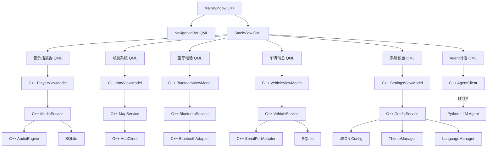

# DESIGN - 车载娱乐系统架构设计

## 1. 整体架构（双进程）

```
┌─────────────────────────────────────────────────────────────────────────────┐
│                          进程1: C++ Qt HMI                                   │
│                                                                             │
│  ┌──────────────────────────────────────────────────────────────────────┐  │
│  │  UI 层 (QML)                                                         │  │
│  │  ┌──────────┐ ┌──────────┐ ┌──────────┐ ┌──────────┐ ┌──────────┐   │  │
│  │  │ 播放器UI  │ │ 导航UI   │ │ 蓝牙UI   │ │ 车辆UI   │ │ 设置UI   │   │  │
│  │  │          │ │          │ │          │ │          │ │          │   │  │
│  │  └────┬─────┘ └────┬─────┘ └────┬─────┘ └────┬─────┘ └────┬─────┘   │  │
│  │       │            │            │            │            │          │  │
│  │  ┌────▼────────────▼────────────▼────────────▼────────────▼─────┐    │  │
│  │  │             ViewModel 层 (C++ QObject)                        │    │  │
│  │  │  ┌──────────┐ ┌──────────┐ ┌──────────┐ ┌──────────┐ ┌──────┐│    │  │
│  │  │  │PlayerVM  │ │NavVM     │ │BlueVM    │ │VehicleVM │ │Setting││    │  │
│  │  │  └────┬─────┘ └────┬─────┘ └────┬─────┘ └────┬─────┘ └──┬───┘│    │  │
│  │  └───────┼────────────┼────────────┼────────────┼───────────┼─────┘    │  │
│  ├──────────┼────────────┼────────────┼────────────┼───────────┼──────────┤  │
│  │          │            │            │            │           │           │  │
│  │  ┌───────▼────────────▼────────────▼────────────▼───────────▼──────┐   │  │
│  │  │                  Service 层 (C++)                                │   │  │
│  │  │  ┌──────────┐ ┌──────────┐ ┌──────────┐ ┌──────────┐ ┌────────┐ │   │  │
│  │  │  │MediaSvc  │ │MapSvc    │ │BlueSvc   │ │VehicleSvc│ │CfgSvc  │ │   │  │
│  │  │  └────┬─────┘ └────┬─────┘ └────┬─────┘ └────┬─────┘ └──┬─────┘ │   │  │
│  │  └───────┼────────────┼────────────┼────────────┼───────────┼───────┘   │  │
│  ├──────────┼────────────┼────────────┼────────────┼───────────┼──────────┤  │
│  │          │            │            │            │           │           │  │
│  │  ┌───────▼────────────▼────────────▼────────────▼───────────▼──────┐   │  │
│  │  │               Infrastructure 层 (C++)                            │   │  │
│  │  │  ┌──────┐ ┌──────┐ ┌──────────┐ ┌──────────┐ ┌────────────┐   │   │  │
│  │  │  │Audio │ │HTTP  │ │Bluetooth │ │SerialPort│ │SQLite/JSON │   │   │  │
│  │  │  │Engine│ │Client│ │Adapter   │ │Adapter   │ │Storage     │   │   │  │
│  │  │  └──────┘ └──────┘ └──────────┘ └──────────┘ └────────────┘   │   │  │
│  │  │                                                               │   │  │
│  │  │  ┌────────────────────────────────────────────────────────────┐│   │  │
│  │  │  │ AgentClient (HTTP/JSON via Qt Network)                    ││   │  │
│  │  │  │ 端点: POST /api/chat, POST /api/tool, GET /api/status    ││   │  │
│  │  │  │ 回调: agentReply, toolResult, agentStatus                 ││   │  │
│  │  │  └────────────────────────────────────────────────────────────┘│   │  │
│  │  └──────────────────────────────────────────────────────────────┘   │  │
│  └─────────────────────────────────────────────────────────────────────┘  │
└──────────────────────────────────┬─────────────────────────────────────────┘
                                   │ HTTP REST (localhost:8000)
                                   │
┌──────────────────────────────────▼─────────────────────────────────────────┐
│                          进程2: Python LLM Agent                           │
│                                                                             │
│  ┌──────────────────────────────────────────────────────────────────────┐  │
│  │  FastAPI HTTP Server (uvicorn)                                       │  │
│  │  端点: POST /api/chat → Agent 对话                                  │  │
│  │         POST /api/tool → 工具调用                                    │  │
│  │         GET /api/status → 服务状态                                   │  │
│  ├──────────────────────────────────────────────────────────────────────┤  │
│  │  ┌─────────────────────┐  ┌─────────────────────┐                   │  │
│  │  │  Agent 编排层        │  │  工具执行层          │                   │  │
│  │  │  - LangChain Agent   │  │  - getVehicleInfo() │                   │  │
│  │  │  - 多轮对话管理      │  │  - setTemperature() │                   │  │
│  │  │  - 意图识别          │  │  - navigateTo()     │                   │  │
│  │  │  - 上下文维护        │  │  - searchPOI()      │                   │  │
│  │  └─────────┬───────────┘  └─────────┬───────────┘                   │  │
│  │            │                        │                               │  │
│  │            ▼                        ▼                               │  │
│  │  ┌────────────────────────────────────────────────────────────────┐  │  │
│  │  │  LLM Router                                                    │  │  │
│  │  │  - OpenAI / Claude (云端)                                      │  │  │
│  │  │  - Ollama / llama.cpp (本地离线)                               │  │  │
│  │  └────────────────────────────────────────────────────────────────┘  │  │
│  └──────────────────────────────────────────────────────────────────────┘  │
└─────────────────────────────────────────────────────────────────────────────┘
```

## 2. 分层说明

### 2.1 HMI 侧 (C++ Qt)

| 层级 | 技术 | 职责 |
|------|------|------|
| **UI 层** | QML + Qt Quick Controls 2 | 界面渲染、用户交互、动画效果 |
| **ViewModel 层** | C++ QObject, Property/Signal/Slot | 状态管理、数据绑定、UI事件处理 |
| **Service 层** | C++ 类, Signal/Slot | 业务逻辑封装、模块协调 |
| **Infrastructure 层** | Qt Modules (Multimedia/Network/SQL) + Win32 API | 硬件抽象、数据持久化、网络通信 |

### 2.2 Agent 侧 (Python)

| 模块 | 技术 | 职责 |
|------|------|------|
| **FastAPI Server** | uvicorn + FastAPI | 接收 HMI HTTP 请求，返回 JSON 响应 |
| **Agent 编排** | LangChain / LangGraph | 多轮对话、工具调用、意图识别 |
| **LLM Router** | langchain-community / ollama | 统一 LLM 调用接口，支持云端/本地切换 |
| **工具链** | Python functions | 车辆信息查询、导航控制、设置操作等 |

## 3. 进程间通信 (HTTP/JSON)

### 3.1 HTTP API 定义

```
Base URL: http://localhost:8000
Content-Type: application/json
```

#### POST /api/chat — 对话查询

```json
Request:
{
  "session_id": "session_abc123",
  "message": "导航到最近加油站",
  "history": [
    {"role": "system", "content": "你是车载助手..."},
    {"role": "user", "content": "你好"},
    {"role": "assistant", "content": "你好！有什么需要帮助的？"}
  ]
}

Response 200:
{
  "reply": "好的，正在查找最近的加油站...",
  "tools": [
    {"name": "search_poi", "arguments": {"query": "加油站", "category": "gas_station"}}
  ],
  "requires_confirmation": false,
  "error": null
}
```

#### POST /api/tool — 工具执行结果上报

```json
Request:
{
  "tool_name": "search_poi",
  "parameters": {
    "query": "加油站",
    "category": "gas_station"
  },
  "result": {
    "pois": [{"name": "中石化加油站", "distance": "1.2km", "lat": 39.9, "lng": 116.4}]
  }
}

Response 200:
{
  "success": true,
  "result": "找到 3 个加油站，最近的是中石化加油站，距离 1.2 公里",
  "error": null
}
```

#### GET /api/status — 查询 Agent 状态

```json
Response 200:
{
  "state": "IDLE",              // IDLE | PROCESSING | ERROR
  "active_model": "gpt-4o-mini",
  "is_online": true,
  "session_count": 5
}
```

### 3.2 AgentClient (C++ → HTTP → Python Agent)

```cpp
// AgentClient - C++ 端 HTTP 客户端 (Qt Network)
class AgentClient : public QObject {
    Q_OBJECT
public:
    explicit AgentClient(const QString &baseUrl = "http://localhost:8000",
                         QObject *parent = nullptr);
    ~AgentClient() override;

    // 设置 Agent 服务地址
    void setBaseUrl(const QString &url);
    QString baseUrl() const { return m_baseUrl; }
    bool isOnline() const { return m_isOnline; }

    // POST /api/chat — 发送对话
    void sendChatMessage(const QString &message,
                         const QString &sessionId = "");
    // POST /api/tool — 执行工具
    void executeTool(const QString &toolName,
                     const QVariantMap &params);
    // GET /api/status — 获取 Agent 状态
    void queryStatus();

signals:
    void agentReply(const QString &text);
    void agentToolRequest(const QString &toolName,
                          const QVariantMap &arguments);
    void agentError(const QString &error);
    void agentStatusChanged(const QString &state,
                            bool isOnline);

private:
    QNetworkAccessManager *m_networkManager;
    QString m_baseUrl;
    bool m_isOnline = false;

    void handleChatReply(QNetworkReply *reply);
    void handleToolReply(QNetworkReply *reply);
    void handleStatusReply(QNetworkReply *reply);
};
```

## 4. 模块依赖图



## 5. 项目目录结构

```
Car_entertainment_system/
│
├── hmi/                                  # === C++ Qt HMI ===
│   ├── CMakeLists.txt                    # 顶层 CMake 构建文件
│   ├── src/
│   │   ├── main.cpp                      # 应用入口（QGuiApplication + QQmlApplicationEngine）
│   │   ├── ui/                           # QML 资源文件
│   │   │   ├── main.qml                  # 主界面框架
│   │   │   ├── components/               # 通用组件
│   │   │   │   ├── NavBar.qml
│   │   │   │   ├── MusicControlBar.qml
│   │   │   │   ├── GaugeWidget.qml
│   │   │   │   ├── DialPad.qml
│   │   │   │   └── Toast.qml
│   │   │   ├── pages/                    # 页面
│   │   │   │   ├── PlayerPage.qml
│   │   │   │   ├── NavigationPage.qml
│   │   │   │   ├── BluetoothPage.qml
│   │   │   │   ├── VehiclePage.qml
│   │   │   │   ├── SettingsPage.qml
│   │   │   │   └── AgentChatPage.qml
│   │   │   └── themes/
│   │   │       ├── ThemeLight.qml
│   │   │       └── ThemeDark.qml
│   │   ├── viewmodel/                    # C++ ViewModel (QObject)
│   │   │   ├── player_viewmodel.h/.cpp
│   │   │   ├── nav_viewmodel.h/.cpp
│   │   │   ├── bluetooth_viewmodel.h/.cpp
│   │   │   ├── vehicle_viewmodel.h/.cpp
│   │   │   └── settings_viewmodel.h/.cpp
│   │   ├── service/                      # C++ Service 层
│   │   │   ├── media_service.h/.cpp
│   │   │   ├── map_service.h/.cpp
│   │   │   ├── bluetooth_service.h/.cpp
│   │   │   ├── vehicle_service.h/.cpp
│   │   │   └── config_service.h/.cpp
│   │   └── infrastructure/               # C++ 基础设施（已实现）
│   │       ├── audio_engine.h/.cpp         # Qt Multimedia (QMediaPlayer)
│   │       ├── http_client.h/.cpp          # Qt Network (QNetworkAccessManager)
│   │       ├── agent_client.h/.cpp         # Agent HTTP Client (QNetworkAccessManager)
│   │       ├── bluetooth_adapter.h/.cpp    # Win32 Bluetooth API（已实现）
│   │       ├── serial_port_adapter.h/.cpp  # Win32 API 串口（已实现）
│   │       ├── database.h/.cpp             # Qt SQL (QSqlDatabase + SQLite)
│   │       └── config_manager.h/.cpp       # Qt Core (QJsonDocument)
│   └── resources/
│       ├── qml.qrc                      # Qt 资源文件
│       ├── icons/
│       └── i18n/
│           ├── car_entertainment_zh_CN.ts
│           └── car_entertainment_en_US.ts
│
├── agent/                                # === Python LLM Agent ===
│   ├── requirements.txt                  # pip 依赖
│   ├── server.py                         # FastAPI Server 启动入口
│   ├── config.py                         # Agent 配置
│   ├── llm_agent/
│   │   ├── __init__.py
│   │   ├── agent.py                      # LangChain Agent 核心
│   │   ├── tools.py                      # 工具函数定义
│   │   ├── chain.py                      # 对话链/路由
│   │   └── session.py                    # 会话管理
│   └── proto/
│       └── car_assistant.proto           # gRPC proto 定义（后续升级时使用）
│
├── tests/
│   ├── hmi_tests/                        # C++ 测试（后续补充）
│   │   └── CMakeLists.txt
│   └── agent_tests/                      # Python 测试（后续补充）
│       ├── __init__.py
│       ├── test_agent.py
│       └── test_tools.py
│
├── docs/
│   └── 车载娱乐系统/
│       ├── ALIGNMENT_车载娱乐系统.md
│       ├── CONSENSUS_车载娱乐系统.md
│       ├── DESIGN_车载娱乐系统.md
│       └── TASKS_车载娱乐系统.md
│
├── .gitignore
└── README.md
```

## 6. 数据流向

### 6.1 HMI 内部（C++ Qt）

```
用户操作 → QML UI → ViewModel (Slot) → Service → Infrastructure
                                                          ↓
用户界面 ← QML绑定 ← ViewModel (Signal) ← Service ← 数据返回
```

### 6.2 HMI ↔ Agent（HTTP 跨进程）

```
用户输入 → AgentChatPage(QML)
                ↓
        AgentClient(C++) → HTTP/JSON → FastAPI Server (:8000)
                ↓                              ↓
        QML 显示返回结果 ←─── AgentClient ←─── LangChain Agent
                                                  ↓    ↓
                                            LLM调用  工具执行
```

## 7. 核心接口契约

### 7.1 ViewModel → QML 接口 (C++ QObject)

```cpp
// === PlayerViewModel ===
Q_PROPERTY(QString currentSongTitle READ ... NOTIFY ...)
Q_PROPERTY(QString currentArtist READ ... NOTIFY ...)
Q_PROPERTY(int playbackState READ ... NOTIFY ...)  // 0=停止 1=播放 2=暂停
Q_PROPERTY(int volume READ ... NOTIFY ...)
Q_PROPERTY(int progress READ ... NOTIFY ...)

public slots:
    void play();
    void pause();
    void next();
    void previous();
    void setVolume(int vol);
    void seek(int pos);

signals:
    void songChanged();
    void playbackStateChanged();
    void volumeChanged();
    void progressChanged();
    void errorOccurred(QString message);

// === SettingsViewModel ===
Q_PROPERTY(QString currentLanguage READ ... NOTIFY ...)
Q_PROPERTY(QString currentTheme READ ... NOTIFY ...)

public slots:
    void setLanguage(const QString& lang);
    void setTheme(const QString& theme);

// === BluetoothViewModel ===
Q_PROPERTY(bool isConnected READ ... NOTIFY ...)
Q_PROPERTY(QString deviceName READ ... NOTIFY ...)
Q_PROPERTY(QVariantList deviceList READ ... NOTIFY ...)

public slots:
    void startScan();
    void connect(const QString& address);
    void disconnect();
    void dial(const QString& number);

// === VehicleViewModel ===
Q_PROPERTY(double speed READ ... NOTIFY ...)
Q_PROPERTY(double rpm READ ... NOTIFY ...)
Q_PROPERTY(double fuelLevel READ ... NOTIFY ...)
Q_PROPERTY(double mileage READ ... NOTIFY ...)
Q_PROPERTY(double fuelConsumption READ ... NOTIFY ...)

// === NavViewModel ===
Q_PROPERTY(double currentLat READ ... NOTIFY ...)
Q_PROPERTY(double currentLng READ ... NOTIFY ...)

public slots:
    void searchPOI(const QString& query);
    void navigateTo(double lat, double lng);
```

## 8. 异常处理策略

| 异常类型 | 处理方式 | 用户反馈 |
|---------|---------|---------|
| 文件加载失败 | 静默降级，使用默认值 | Toast提示 |
| 蓝牙连接失败 | 自动重试3次 | 状态栏显示 |
| 网络请求超时 | 返回缓存数据 | 提示"网络不可用" |
| 串口通信异常 | 模拟数据模式 | 状态指示灯 |
| HTTP 连接断开 / 超时 | HMI 进入离线模式，核心功能不中断 | Agent 页显示"离线" |
| LLM 调用超时 | Agent 返回降级回复 | "稍后再试"提示 |
| LLM 无网络 | 切换本地模型(Ollama) | 状态栏显示"离线模式" |

## 9. 构建与运行

### 9.1 C++ HMI 构建 (CMake)

```bash
cd hmi
# 首次配置
cmake -B build -G "MinGW Makefiles" -DCMAKE_PREFIX_PATH=E:/Qt/6.11.1/mingw_64
# 编译
cmake --build build
# 运行
./build/car_hmi.exe
```

> **注意**: Ninja 在包含中文字符的路径下存在编码问题，建议使用 `MinGW Makefiles` 生成器。

### 9.2 Python Agent 运行

```bash
cd agent
pip install -r requirements.txt
python server.py
# FastAPI Server 启动在 http://localhost:8000
```

### 9.3 CMake 配置参考

```cmake
cmake_minimum_required(VERSION 3.20)
project(CarHMI VERSION 1.0 LANGUAGES CXX)

set(CMAKE_CXX_STANDARD 17)
set(CMAKE_CXX_STANDARD_REQUIRED ON)
set(CMAKE_AUTOMOC ON)
set(CMAKE_PREFIX_PATH "E:/Qt/6.11.1/mingw_64")

find_package(Qt6 REQUIRED COMPONENTS
    Quick QuickControls2 Multimedia Sql Network Concurrent
)

add_executable(car_hmi
    src/main.cpp
    # QML 资源
    resources/qml.qrc
    # Infrastructure (已实现)
    src/infrastructure/agent_client.h
    src/infrastructure/agent_client.cpp
    src/infrastructure/http_client.h
    src/infrastructure/http_client.cpp
    src/infrastructure/bluetooth_adapter.h
    src/infrastructure/bluetooth_adapter.cpp
    src/infrastructure/serial_port_adapter.h
    src/infrastructure/serial_port_adapter.cpp
    src/infrastructure/audio_engine.h
    src/infrastructure/audio_engine.cpp
    src/infrastructure/database.h
    src/infrastructure/database.cpp
    src/infrastructure/config_manager.h
    src/infrastructure/config_manager.cpp
)

target_link_libraries(car_hmi PRIVATE
    Qt6::Quick Qt6::QuickControls2 Qt6::Multimedia
    Qt6::Sql Qt6::Network Qt6::Concurrent
    Bthprops Ws2_32 Irprops
)

## 10. 新增功能/模块操作指南

本文档作为未来扩展功能的标准化操作指南。新增功能后需同步更新此清单。

### 10.1 新增 UI 功能模块（标准流程）

以下 9 步覆盖从零开始添加一个带 UI 的新模块。

| 步骤 | 位置 | 文件/操作 | 示例（加"空调控制"） |
|------|------|----------|---------------------|
| ① | `hmi/src/infrastructure/` | 新增适配器类（如需硬件操作） | `climate_adapter.h/.cpp` — 封装空调串口协议 |
| ② | `hmi/src/service/` | 新增 Service 类（业务逻辑） | `climate_service.h/.cpp` — 温度/风量/模式控制 |
| ③ | `hmi/src/service/` | 注册 Service 到依赖（如有跨模块调用） | 等待 MediaService 停止播放等 |
| ④ | `hmi/src/viewmodel/` | 新增 ViewModel 类（QObject） | `climate_viewmodel.h/.cpp` — Q_PROPERTY 暴露温度等属性 |
| ⑤ | `hmi/src/ui/pages/` | 新增 QML 页面 | `ClimatePage.qml` — 温控面板 UI |
| ⑥ | `hmi/src/ui/components/` | 新增或复用通用组件 | `ClimateSlider.qml`（可选） |
| ⑦ | `hmi/src/ui/main.qml` | 导航栏加一个条目 | `NavButton { icon: "climate"; page: ClimatePage {} }` |
| ⑧ | `hmi/src/main.cpp` | `qmlRegisterType<ClimateViewModel>()` | 注册到 QML 运行时 |
| ⑨ | `hmi/CMakeLists.txt` | 加新文件到 `add_executable` | 4 个 .h/.cpp 文件 |

**不需要修改**：其他 5 个已有页面的 QML/ViewModel/Service。

### 10.2 新增无 UI 的后台模块

无需 QML 层和 ViewModel 层，直接减为 3 步：

| 步骤 | 文件/操作 |
|------|----------|
| ① | Infrastructure 层编写驱动/协议适配器 |
| ② | Service 层封装业务逻辑 |
| ③ | `main.cpp` 中构造 Service 对象并启动 |

### 10.3 新增 Agent 工具（Python 侧）

**只改 Python，不动 C++**，HMI 侧零编译。

| 步骤 | 文件 | 操作 |
|------|------|------|
| ① | `agent/llm_agent/tools.py` | 用 `@tool` 装饰器加一个函数，写 docstring 作为 LLM 的 tool description |
| ② | `agent/llm_agent/agent.py` | 将新工具加入 `tools` 列表 |

工具函数示例：

```python
@tool
def set_ac_temperature(temp: int) -> str:
    """设置空调目标温度（摄氏度）。参数 temp: 16-30 之间的整数。"""
    # 通过 HTTP 通知 HMI 执行（或直接通过串口发送指令）
    return f"空调温度已设为 {temp}°C"
```

**Agent 自动触发**：LLM 识别到用户说"空调调到 24 度"后，自动调用 `set_ac_temperature(24)`，HMI 通过 `/api/tool` 接收执行结果。

### 10.4 扩展数据源

| 场景 | 做法 |
|------|------|
| 新增 SQLite 表 | `database.h` 加建表语句 + 对应的 CRUD 方法 |
| 新增 JSON 配置项 | `config_manager.h` 加 getter/setter，settings_viewmodel 绑定 |
| 新增 HTTP API 端点 | Agent 侧 FastAPI 加路由，HMI 侧 AgentClient 或 http_client 加请求方法 |

### 10.5 注意事项

| 事项 | 说明 |
|------|------|
| **编译开销** | 模块超过 15~20 个时，建议引入 `QPluginLoader` 实现动态库插件化，避免链接时间过长 |
| **蓝牙/串口扩展** | 蓝牙和串口不走标准 Qt 模块，需掌握 Win32 API。建议封装为 Resource 类（单例），多个 Service 共享同一个串口/蓝牙实例 |
| **命名规范** | 文件命名统一 `snake_case`：`climate_service.h`，QML 组件用 PascalCase：`ClimatePage.qml` |
| **文档同步** | 新增模块后在本文件 10.1 的示例表末尾追加一行，保持指南可复现 |
| **测试** | 参考 T14（HMI 单元测试）和 T15（Agent 测试），新模块需附带测试用例 |
```
