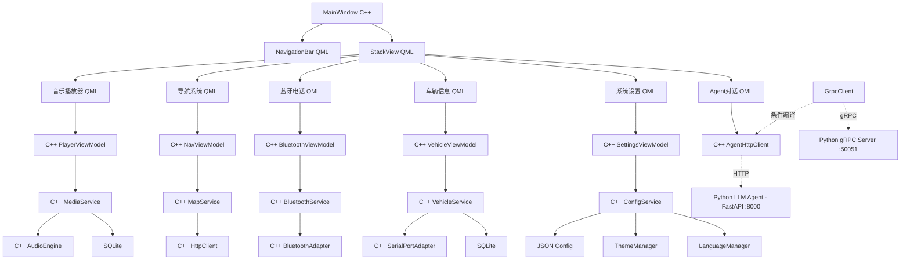

# DESIGN - 车载娱乐系统架构设计

## 1. 整体架构（双进程 + 双协议）

```
┌─────────────────────────────────────────────────────────────────────────────┐
│                          进程1: C++ Qt HMI                                   │
│                                                                             │
│  ┌──────────────────────────────────────────────────────────────────────┐  │
│  │  UI 层 (QML)                                                         │  │
│  │  ┌──────────┐ ┌──────────┐ ┌──────────┐ ┌──────────┐ ┌──────────┐   │  │
│  │  │ 播放器UI  │ │ 导航UI   │ │ 蓝牙UI   │ │ 车辆UI   │ │ 设置UI   │   │  │
│  │  │          │ │          │ │          │ │          │ │          │   │  │
│  │  └────┬─────┘ └────┬─────┘ └────┬─────┘ └────┬─────┘ └────┬─────┘   │  │
│  │       │            │            │            │            │          │  │
│  │  ┌────▼────────────▼────────────▼────────────▼────────────▼─────┐    │  │
│  │  │             ViewModel 层 (C++ QObject)                        │    │  │
│  │  │  ┌──────────┐ ┌──────────┐ ┌──────────┐ ┌──────────┐ ┌──────┐│    │  │
│  │  │  │PlayerVM  │ │NavVM     │ │BlueVM    │ │VehicleVM │ │Setting││    │  │
│  │  │  └────┬─────┘ └────┬─────┘ └────┬─────┘ └────┬─────┘ └──┬───┘│    │  │
│  │  └───────┼────────────┼────────────┼────────────┼───────────┼─────┘    │  │
│  ├──────────┼────────────┼────────────┼────────────┼───────────┼──────────┤  │
│  │          │            │            │            │           │           │  │
│  │  ┌───────▼────────────▼────────────▼────────────▼───────────▼──────┐   │  │
│  │  │                  Service 层 (C++)                                │   │  │
│  │  │  ┌──────────┐ ┌──────────┐ ┌──────────┐ ┌──────────┐ ┌────────┐ │   │  │
│  │  │  │MediaSvc  │ │MapSvc    │ │BlueSvc   │ │VehicleSvc│ │CfgSvc  │ │   │  │
│  │  │  └────┬─────┘ └────┬─────┘ └────┬─────┘ └────┬─────┘ └──┬─────┘ │   │  │
│  │  └───────┼────────────┼────────────┼────────────┼───────────┼───────┘   │  │
│  ├──────────┼────────────┼────────────┼────────────┼───────────┼──────────┤  │
│  │          │            │            │            │           │           │  │
│  │  ┌───────▼────────────▼────────────▼────────────▼───────────▼──────┐   │  │
│  │  │               Infrastructure 层 (C++)                            │   │  │
│  │  │  ┌──────┐ ┌──────────┐ ┌──────────┐ ┌──────────┐ ┌──────────┐│   │  │
│  │  │  │Audio │ │Bluetooth │ │SerialPort│ │SQLite/   │ │ConfigMgr ││   │  │
│  │  │  │Engine│ │Adapter   │ │Adapter   │ │DB        │ │(JSON)    ││   │  │
│  │  │  └──────┘ └──────────┘ └──────────┘ └──────────┘ └──────────┘│   │  │
│  │  │  ┌────────────────────┐  ┌────────────────────┐              │   │  │
│  │  │  │ AgentHttpClient    │  │ GrpcClientAdapter  │              │   │  │
│  │  │  │ (HTTP/JSON :8000)  │  │ (gRPC stub :50051) │              │   │  │
│  │  │  │ (主通信方式)       │  │ (条件编译开关)     │              │   │  │
│  │  │  └────────────────────┘  └────────────────────┘              │   │  │
│  │  └──────────────────────────────────────────────────────────────┘   │  │
│  └─────────────────────────────────────────────────────────────────────┘  │
└──────────────────────────────────┬─────────────────────────────────────────┘
                                   │ HTTP/JSON :8000 (主) / gRPC :50051 (可选)
                                   │
┌──────────────────────────────────▼─────────────────────────────────────────┐
│                          进程2: Python LLM Agent                           │
│                                                                             │
│  ┌───────────────────┐  ┌────────────────────┐  ┌────────────────────┐    │
│  │ FastAPI HTTP Svr  │  │ gRPC Server        │  │ Agent 核心          │    │
│  │ :8000             │  │ :50051             │  │                     │    │
│  │ health/chat/stream│  │ GetHealth/ChatQuery│  │ LangChain Agent     │    │
│  │ /command          │  │ StreamChat/ToolExec│  │ LLM/Mock/降级       │    │
│  │ + API Key 鉴权    │  │ + 反射(grpcurl)    │  │ session/chain/router│    │
│  └───────────────────┘  └────────────────────┘  └────────────────────┘    │
└─────────────────────────────────────────────────────────────────────────────┘
```

## 2. 分层说明

### 2.1 HMI 侧 (C++ Qt)

| 层级 | 技术 | 职责 |
|------|------|------|
| **UI 层** | QML + Qt Quick Controls 2 | 界面渲染、用户交互、动画效果、国际化 (qsTr) |
| **ViewModel 层** | C++ QObject, Property/Signal/Slot | 状态管理、数据绑定、UI事件处理 |
| **Service 层** | C++ 类, Signal/Slot | 业务逻辑封装、模块协调 |
| **Infrastructure 层** | Qt Modules (Multimedia/Network/SQL) + Win32 API | 硬件抽象、数据持久化、网络通信 |

### 2.2 Agent 侧 (Python)

| 模块 | 技术 | 职责 |
|------|------|------|
| **FastAPI Server** | uvicorn + FastAPI | 接收 HMI HTTP 请求，返回 JSON 响应，API 鉴权 |
| **gRPC Server** | grpcio | 双协议支持，rRPC 反射，流式响应 |
| **Agent 编排** | LangChain / LangGraph | 多轮对话、工具调用、意图识别 |
| **LLM Router** | langchain-community / ollama | 统一 LLM 调用接口，支持云端/本地切换 |
| **工具链** | Python functions | 车辆信息查询、导航控制、设置操作等 |

## 3. 进程间通信

### 3.1 HTTP/JSON (主通信方式)

```
Base URL: http://localhost:8000
Content-Type: application/json
Auth Header: X-API-Key (可选)
```

#### POST /api/chat — 对话查询
```json
Request:  { "session_id": "...", "message": "导航到最近加油站", "history": [...] }
Response: { "reply": "...", "tools": [...], "requires_confirmation": false }
```

#### POST /api/command — 工具执行
```json
Request:  { "tool_name": "search_poi", "parameters": {"query": "加油站"} }
Response: { "success": true, "data": "{...}" }
```

#### GET /api/health — 健康检查
```json
Response: { "status": "ok", "llm_available": true, "tools_count": 8 }
```

### 3.2 gRPC (可选，条件编译)

| RPC | 对应 HTTP 端点 | 流模式 |
|-----|---------------|--------|
| `GetHealth(Empty) → HealthResponse` | GET /api/health | Unary |
| `ChatQuery(ChatRequest) → ChatResponse` | POST /api/chat | Unary |
| `StreamChat(ChatRequest) → stream ChatResponse` | POST /api/chat/stream | Server-Side Streaming |
| `ExecuteTool(ToolRequest) → ToolResponse` | POST /api/command | Unary |

### 3.3 AgentClient (C++)

| 类 | 通信方式 | 编译条件 | 状态 |
|---|---------|---------|:----:|
| `AgentHttpClient` | HTTP/JSON | 始终启用 | ✅ 主通信方式 |
| `GrpcClientAdapter` | gRPC protobuf | `#ifdef CAR_HMI_USE_GRPC` | 🔶 stub 模式可用，完整需 VS+vcpkg |

```cpp
// GrpcClientAdapter — 条件编译
class GrpcClientAdapter : public QObject {
    Q_OBJECT
    // 接口与 AgentHttpClient 对齐
    void sendChat(const QString &message, const QString &sessionId = ...);
    void healthCheck(Callback callback = ...);
    void sendCommand(const QString &command, const QJsonObject &args = ...);
signals:
    void chatResponseReceived(const QString &reply);
    void errorOccurred(const QString &error);
};
```

## 4. 模块依赖图



## 5. 项目目录结构（最终版）

```
Car_entertainment_system/
│
├── hmi/                                  # === C++ Qt HMI ===
│   ├── CMakeLists.txt                    # 含可选 gRPC 编译块
│   ├── src/
│   │   ├── main.cpp                      # 国际化加载增强（locale 降级）
│   │   ├── ui/                           # QML 资源文件
│   │   │   ├── main.qml                  # 主界面框架
│   │   │   ├── components/               # 通用组件（NavBar/DialPad/Toast 等）
│   │   │   ├── pages/                    # 6 页面
│   │   │   └── themes/                   # ThemeLight / ThemeDark
│   │   ├── viewmodel/                    # 5 个 ViewModel
│   │   ├── service/                      # 5 Service + 2 Agent Client
│   │   │   ├── agent_http_client.h/.cpp  # HTTP 主通信
│   │   │   └── grpc_client_adapter.h/.cpp# gRPC 条件编译适配
│   │   └── infrastructure/
│   │       ├── audio_engine.h/.cpp
│   │       ├── bluetooth_adapter.h/.cpp  # Win32 API
│   │       ├── serial_port_adapter.h/.cpp# Win32 API
│   │       ├── database.h/.cpp
│   │       ├── config_manager.h/.cpp
│   │       └── proto/                    # C++ protobuf 消息类（gRPC 用）
│   ├── tests/
│   │   └── test_config.cpp               # 8/8 通过
│   ├── translations/
│   │   ├── zh_CN.ts / zh_CN.qm           # 中文翻译
│   │   └── en.ts / en.qm                 # 英文翻译（29 条）
│   └── resources/
│       └── qml.qrc                       # 含翻译 + 页面资源
│
├── agent/                                # === Python LLM Agent ===
│   ├── requirements.txt                  # 含 grpcio/grpcio-tools
│   ├── server.py                         # FastAPI HTTP Server (:8000, 含鉴权)
│   ├── grpc_server.py                    # gRPC Server (:50051, 4 RPC)
│   ├── config.py                         # 含 API_AUTH_KEY / GRPC_PORT
│   ├── .env.example                      # 环境配置模板
│   ├── llm_agent/
│   │   ├── agent.py                      # LangChain Agent
│   │   ├── tools.py                      # 8 个工具
│   │   ├── chain.py                      # 对话链
│   │   └── session.py                    # 会话管理
│   └── proto/
│       ├── car_assistant.proto           # gRPC proto 定义
│       ├── car_assistant_pb2.py          # Python gRPC 生成
│       ├── car_assistant_pb2_grpc.py
│       └── __init__.py
│
├── deploy/                               # === 生产部署 ===
│   ├── pack_hmi.ps1                      # 打包 HMI + Agent → dist/
│   ├── install_service.ps1               # NSSM Windows 服务安装
│   └── uninstall_service.ps1             # 服务卸载
│
├── tests/
│   └── agent_tests/                      # Agent pytest (11/11)
│
├── docs/车载娱乐系统/                    # 7 份完整文档
│
├── .gitignore
└── README.md
```

## 6. 数据流向

### 6.1 HMI 内部（C++ Qt）
```
用户操作 → QML UI → ViewModel (Slot) → Service → Infrastructure
                                                          ↓
用户界面 ← QML绑定 ← ViewModel (Signal) ← Service ← 数据返回
```

### 6.2 HMI ↔ Agent（HTTP 主通信）
```
用户输入 → AgentChatPage(QML)
                ↓
        AgentHttpClient(C++) → HTTP/JSON → FastAPI Server (:8000)
                ↓                              ↓
        QML 显示返回结果 ←─── AgentHttpClient ←─── LangChain Agent
                                                  ↓      ↓
                                            LLM调用  工具执行
```

### 6.3 HMI ↔ Agent（gRPC 可选通信）
```
用户输入 → AgentChatPage(QML)
                ↓
        GrpcClientAdapter(C++) → gRPC protobuf → gRPC Server (:50051)
                ↓                                    ↓
        QML 显示返回结果 ←─── GrpcClientAdapter ←─── LangChain Agent
                                                      ↓      ↓
                                                LLM调用  工具执行
```

## 7. 异常处理策略

| 异常类型 | 处理方式 | 用户反馈 |
|---------|---------|---------|
| 文件加载失败 | 静默降级，使用默认值 | Toast提示 |
| 蓝牙连接失败 | 自动重试3次 | 状态栏显示 |
| 网络请求超时 | 返回缓存数据 | 提示"网络不可用" |
| 串口通信异常 | 模拟数据模式 | 状态指示灯 |
| HTTP 连接断开 | HMI 进入离线模式 | Agent 页显示"离线" |
| gRPC 连接失败 | C++ stub 模式无操作 | HTTP 通信不受影响 |
| LLM 调用超时 | Agent 返回降级回复 | "稍后再试"提示 |
| LLM 无网络 | 切换本地模型(Ollama) | 状态栏显示"离线模式" |
| API 鉴权失败 | Server 返回 401 | HMI 不特别处理 |
