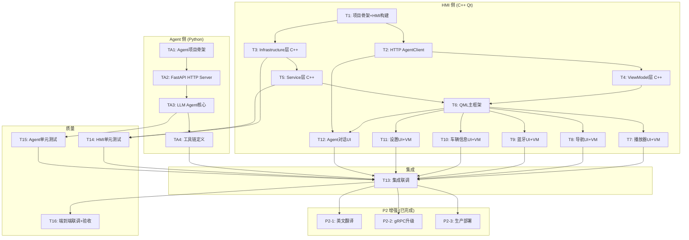

# TASKS - 车载娱乐系统原子任务拆分

## 任务依赖图

## 任务概览

| 编号 | 名称 | 技术栈 | 状态 |
|------|------|--------|:----:|
| **T1** | 项目骨架 + HMI 构建系统 | CMake + Qt6 | ✅ |
| **T2** | Agent HTTP Client (Qt Network) | C++ + Qt Network | ✅ |
| **T3** | Infrastructure 基础设施层 | C++ Qt Modules + Win32 API | ✅ |
| **T4** | ViewModel 层 | C++ QObject | ✅ |
| **T5** | Service 业务服务层 | C++ | ✅ |
| **T6** | QML 主框架 | QML + Qt Quick | ✅ |
| **T7** | 音乐播放器 (UI+VM) | QML + C++ | ✅ |
| **T8** | 导航系统 (UI+VM) | QML + C++ | ✅ |
| **T9** | 蓝牙电话 (UI+VM) | QML + C++ | ✅ |
| **T10** | 车辆信息 (UI+VM) | QML + C++ | ✅ |
| **T11** | 系统设置 (UI+VM) | QML + C++ | ✅ |
| **T12** | Agent 对话页面 | QML + C++ AgentClient | ✅ |
| **TA1** | Agent 项目骨架 | Python | ✅ |
| **TA2** | Agent FastAPI HTTP Server | Python FastAPI + uvicorn | ✅ |
| **TA3** | LLM Agent 核心 | Python LangChain | ✅ |
| **TA4** | 工具链定义 | Python | ✅ |
| **T14** | HMI 单元测试 | Qt Test | ✅ |
| **T15** | Agent 单元测试 | pytest | ✅ |
| **T13** | 集成联调 | C++ + Python | ✅ |
| **T16** | 端到端验收 | - | ✅ |
| **P2-1** | **英文翻译** | Qt lrelease | ✅ |
| **P2-2** | **gRPC 升级** | protobuf + grpcio | ✅ |
| **P2-3** | **生产部署增强** | PowerShell + NSSM | ✅ |

---
