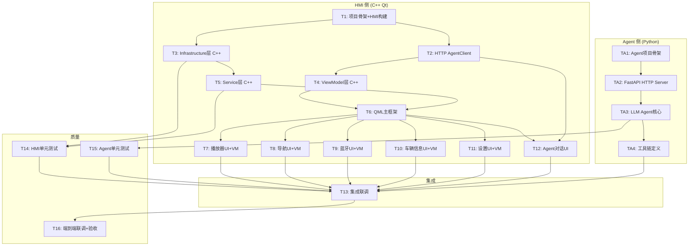

# TASKS - 车载娱乐系统原子任务拆分

## 任务依赖图



## 任务概览

| 编号 | 名称 | 技术栈 | 预估量级 |
|------|------|--------|---------|
| **T1** | 项目骨架 + HMI 构建系统 | CMake + Qt6 | 中 |
| **T2** | Agent HTTP Client (Qt Network) | C++ + Qt Network | 小 |
| **T3** | Infrastructure 基础设施层 | C++ Qt Modules + Win32 API | 大 |
| **T4** | ViewModel 层 | C++ QObject | 大 |
| **T5** | Service 业务服务层 | C++ | 大 |
| **T6** | QML 主框架 | QML + Qt Quick | 中 |
| **T7** | 音乐播放器 (UI+VM) | QML + C++ | 中 |
| **T8** | 导航系统 (UI+VM) | QML + C++ | 中 |
| **T9** | 蓝牙电话 (UI+VM) | QML + C++ | 中 |
| **T10** | 车辆信息 (UI+VM) | QML + C++ | 中 |
| **T11** | 系统设置 (UI+VM) | QML + C++ | 中 |
| **T12** | Agent 对话页面 | QML + C++ AgentClient | 小 |
| **TA1** | Agent 项目骨架 | Python | 小 |
| **TA2** | Agent FastAPI HTTP Server | Python FastAPI + uvicorn | 中 |
| **TA3** | LLM Agent 核心 | Python LangChain | 大 |
| **TA4** | 工具链定义 | Python | 中 |
| **T14** | HMI 单元测试 | Qt Test / Google Test | 中 |
| **T15** | Agent 单元测试 | pytest | 中 |
| **T13** | 集成联调 | C++ + Python | 大 |
| **T16** | 端到端验收 | - | 中 |

---

## HMI 侧任务

### T1: 项目骨架 + HMI 构建系统

| 属性 | 内容 |
|------|------|
| **描述** | 创建项目目录结构，配置 CMake 构建系统，编写 main.cpp 入口，初始化 QML 引擎，输出可运行窗口 |
| **前置依赖** | Qt 6 SDK 已安装，CMake 3.20+ 已安装 |
| **输入契约** | Qt6::Quick / QuickControls2 / Multimedia / Sql / Network / Concurrent 可用 |
| **输出交付物** | 可编译运行的空白 Qt 窗口程序 + 完整 CMakeLists.txt |
| **验收标准** | `cd hmi && cmake -B build -G "MinGW Makefiles" -DCMAKE_PREFIX_PATH=E:/Qt/6.11.1/mingw_64 && cmake --build build` 成功 |
| **技术约束** | C++17, CMake 3.20+, Qt 6.11.1, MinGW 编译器 |
| **后置任务** | T2, T3 |

#### 子任务
- **T1.1**: 创建目录结构 (hmi/src/ui/pages, hmi/src/viewmodel, hmi/src/service, hmi/src/infrastructure, hmi/resources)
- **T1.2**: 编写顶层 CMakeLists.txt（含 AUTOMOC + 所有 Qt 模块 + 手写补齐库）
- **T1.3**: 编写 main.cpp (QGuiApplication + QQmlApplicationEngine)
- **T1.4**: 编写最小 main.qml (Window 组件)
- **T1.5**: 配置 qml.qrc 资源文件
- **T1.6**: 验证编译通过 + 运行显示空白窗口

---

### T2: Agent HTTP Client (Qt Network)

| 属性 | 内容 |
|------|------|
| **描述** | 实现基于 Qt Network (QNetworkAccessManager) 的 HTTP/JSON 客户端，封装三个 API 端点 |
| **前置依赖** | T1 |
| **输入契约** | Qt6::Network 可用 |
| **输出交付物** | agent_client.h/.cpp |
| **验收标准** | AgentClient 可实例化，连接 localhost:8000，超时后正确返回错误信号 |
| **技术约束** | 使用 Qt Network + QJsonDocument，异步回调模式 |
| **后置任务** | T4, T12 |

#### 子任务
- **T2.1**: 设计 AgentClient 类层次（QObject 继承）
- **T2.2**: 实现 POST /api/chat（发送对话请求）
- **T2.3**: 实现 POST /api/tool（工具执行请求）
- **T2.4**: 实现 GET /api/status（状态查询 + 心跳检测）
- **T2.5**: 实现 JSON 解析和 Signal 回调
- **T2.6**: 实现超时处理 + 离线检测

---

### T3: Infrastructure 基础设施层

| 属性 | 内容 |
|------|------|
| **描述** | 实现所有 C++ 基础设施组件：AudioEngine、HttpClient、BluetoothAdapter、SerialPortAdapter、ConfigManager、Database |
| **前置依赖** | T1 |
| **输入契约** | Qt6::Multimedia / Sql / Network 可用 |
| **输出交付物** | 所有 C++ 基础设施模块 (.h/.cpp) |
| **验收标准** | 各组件可独立编译，ConfigManager 读写 JSON 正常，Database 建表/CRUD 正常，AudioEngine 可播放音频 |
| **技术约束** | 使用 RAII + 智能指针，接口抽象化 |
| **后置任务** | T5, T14 |
| **备注** | BluetoothAdapter 和 SerialPortAdapter 已初步实现（Win32 API），需完善和联调 |

#### 子组件
- **T3.1 AudioEngine**: QMediaPlayer 封装，音频解码/播放/暂停/音量/进度
- **T3.2 HttpClient**: QNetworkAccessManager 封装，GET/POST + JSON 解析
- **T3.3 BluetoothAdapter**: Win32 Bluetooth API 手写封装（已完成，需联调）
- **T3.4 SerialPortAdapter**: Win32 API 手写封装（已完成，需联调）
- **T3.5 ConfigManager**: QJsonDocument 读写，管理应用配置 JSON 文件
- **T3.6 Database**: QSqlDatabase (SQLite)，管理音乐库、通话记录

---

### T4: ViewModel 层

| 属性 | 内容 |
|------|------|
| **描述** | 实现所有 C++ ViewModel（继承 QObject），通过 Property/Signal/Slot 暴露给 QML |
| **前置依赖** | T2 (AgentClient 可用) |
| **输入契约** | - |
| **输出交付物** | 5 个 ViewModel 的 .h/.cpp 文件 |
| **验收标准** | 每个 ViewModel 暴露正确的 Q_PROPERTY 和 Q_INVOKABLE/Slot，可通过 qmlRegisterType 注册到 QML |
| **技术约束** | 继承 QObject，使用 Q_PROPERTY 宏，含 QML_ELEMENT |
| **后置任务** | T6 |

#### 子组件
- **T4.1 PlayerViewModel**: 播放状态、歌曲信息、播放控制槽函数
- **T4.2 NavViewModel**: 导航状态、POI 搜索、路径规划
- **T4.3 BluetoothViewModel**: 设备列表、连接状态、拨号
- **T4.4 VehicleViewModel**: 车速/转速/油量等模拟数据
- **T4.5 SettingsViewModel**: 语言/主题切换

---

### T5: Service 业务服务层

| 属性 | 内容 |
|------|------|
| **描述** | 实现所有 C++ Service，封装业务逻辑，作为 ViewModel 的后端 |
| **前置依赖** | T3 |
| **输入契约** | Infrastructure 组件可用 |
| **输出交付物** | 5 个 Service 的 .h/.cpp 文件 |
| **验收标准** | 各 Service 业务逻辑正确，Signal/Slot 通信正常 |
| **技术约束** | 使用 Signal/Slot 机制通信，QObject 继承 |
| **后置任务** | T6, T14 |

#### 子组件
- **T5.1 MediaService**: 音乐库管理、播放列表、歌曲元数据
- **T5.2 MapService**: 地图瓦片管理、路线规划算法、POI 搜索
- **T5.3 BluetoothService**: 蓝牙设备管理、电话状态机、通话控制
- **T5.4 VehicleService**: 车辆数据采集与解析、模拟数据生成
- **T5.5 ConfigService**: 应用配置读写、主题/语言管理

---

### T6: QML 主框架

| 属性 | 内容 |
|------|------|
| **描述** | 实现主界面框架：main.qml、NavBar 导航栏、StackView 页面切换、全局主题绑定 |
| **前置依赖** | T4, T5 |
| **输入契约** | ViewModel 已通过 qmlContext 注册到 QML 引擎 |
| **输出交付物** | main.qml、NavBar.qml、页面路由 |
| **验收标准** | 导航栏 6 个图标（含 Agent）可点击切换页面，页面切换动画流畅，分辨率自适应 |
| **技术约束** | Qt Quick Controls 2，StackView 管理页面栈 |
| **后置任务** | T7, T8, T9, T10, T11, T12 |

---

### T7: 音乐播放器 (UI+VM)

| 属性 | 内容 |
|------|------|
| **描述** | 实现音乐播放器：歌曲列表、播放控制（播放/暂停/上一首/下一首）、进度条拖动、音量调节、专辑封面 |
| **前置依赖** | T6 |
| **输入契约** | PlayerViewModel 可用 |
| **输出交付物** | PlayerPage.qml + PlayerViewModel 完成 |
| **验收标准** | 歌曲列表可滚动点击，播放控制响应，进度条可拖动，音量滑块有效 |
| **技术约束** | QML 动画过渡，ListView 虚拟化 |

---

### T8: 导航系统 (UI+VM)

| 属性 | 内容 |
|------|------|
| **描述** | 实现导航 UI：地图 Canvas 显示、POI 搜索框、路线信息面板 |
| **前置依赖** | T6 |
| **输入契约** | NavViewModel 可用 |
| **输出交付物** | NavigationPage.qml + NavViewModel 完成 |
| **验收标准** | 地图区域正常显示，POI 搜索功能可用，路线规划显示 |
| **技术约束** | Canvas 绘制地图瓦片或集成在线地图 API |

---

### T9: 蓝牙电话 (UI+VM)

| 属性 | 内容 |
|------|------|
| **描述** | 实现蓝牙电话 UI：设备列表、拨号盘、通话记录、通讯录 |
| **前置依赖** | T6 |
| **输入契约** | BluetoothViewModel 可用 |
| **输出交付物** | BluetoothPage.qml + BluetoothViewModel 完成 |
| **验收标准** | 设备列表展示，拨号盘响应，通话状态显示，通讯录展示 |
| **技术约束** | 模拟 UI 在无蓝牙硬件时可独立展示 |

---

### T10: 车辆信息 (UI+VM)

| 属性 | 内容 |
|------|------|
| **描述** | 实现车辆信息 UI：仪表盘/速度表、车辆状态卡片、数据图表 |
| **前置依赖** | T6 |
| **输入契约** | VehicleViewModel 可用 |
| **输出交付物** | VehiclePage.qml + VehicleViewModel 完成 |
| **验收标准** | 速度/转速表盘动画流畅，车辆状态信息实时更新 |
| **技术约束** | Canvas 或 QML 动画实现仪表盘 |

---

### T11: 系统设置 (UI+VM)

| 属性 | 内容 |
|------|------|
| **描述** | 实现系统设置 UI：主题切换(明亮/黑暗)、语言切换(中/英)、音量/音效设置、关于信息 |
| **前置依赖** | T6 |
| **输入契约** | SettingsViewModel 可用 |
| **输出交付物** | SettingsPage.qml + SettingsViewModel 完成 |
| **验收标准** | 主题切换即时生效，语言切换后界面文本更新，音量滑块有效 |
| **技术约束** | 使用 qsTr() 翻译函数，QQmlPropertyMap 或 QML 绑定实现主题 |

---

### T12: Agent 对话页面 (UI+Client)

| 属性 | 内容 |
|------|------|
| **描述** | 实现 Agent 对话 UI：聊天消息列表、文本输入框、发送按钮、状态指示器、"思考中"动画 |
| **前置依赖** | T6, T2 |
| **输入契约** | AgentClient (HTTP Qt Network) 可用 |
| **输出交付物** | AgentChatPage.qml |
| **验收标准** | 可输入文本发送给 Agent，Agent 回复正确显示，离线状态有提示 |
| **技术约束** | QML ListView 管理消息列表，Binding 绑定 AgentClient 的状态信号 |

---

## Agent 侧任务 (Python)

### TA1: Agent 项目骨架

| 属性 | 内容 |
|------|------|
| **描述** | 创建 agent/ 目录结构，配置 requirements.txt，编写 config.py 和 server.py 框架 |
| **前置依赖** | Python 3.10+ 已安装 |
| **输入契约** | pip 可用 |
| **输出交付物** | agent/ 项目目录、requirements.txt、可导入的空服务框架 |
| **验收标准** | `cd agent && pip install -r requirements.txt && python -c "from llm_agent import agent"` 无报错 |
| **后置任务** | TA2 |

#### requirements.txt 主要内容
```
fastapi>=0.109.0
uvicorn>=0.27.0
pydantic>=2.0.0
langchain>=0.3.0
langchain-community>=0.3.0
langchain-openai>=0.2.0
python-dotenv>=1.0.0
```

---

### TA2: Agent FastAPI HTTP Server

| 属性 | 内容 |
|------|------|
| **描述** | 实现 FastAPI HTTP Server，处理 /api/chat、/api/tool、/api/status 三个端点 |
| **前置依赖** | TA1 |
| **输入契约** | FastAPI + uvicorn 已安装 |
| **输出交付物** | server.py (FastAPI 应用 + 路由) |
| **验收标准** | `python server.py` 启动在 :8000，curl 测试三个端点返回正确 JSON |
| **技术约束** | 使用 FastAPI + uvicorn，异步处理请求 |
| **后置任务** | TA3 |

#### 子任务
- **TA2.1**: 实现 GET /api/status 端点（服务状态 + 模型信息）
- **TA2.2**: 实现 POST /api/chat 端点（接收对话请求）
- **TA2.3**: 实现 POST /api/tool 端点（工具调用结果上报）
- **TA2.4**: 添加 CORS 中间件 + 错误处理

---

### TA3: LLM Agent 核心

| 属性 | 内容 |
|------|------|
| **描述** | 实现 LangChain Agent 核心逻辑：对话管理、LLM 路由（云端/本地）、上下文维护、多轮对话 |
| **前置依赖** | TA2 |
| **输入契约** | FastAPI Server 可接收请求 |
| **输出交付物** | agent.py (Agent 类), chain.py (对话链), session.py (会话管理) |
| **验收标准** | Agent 可接收文本输入，返回 LLM 回复，支持多轮对话上下文记忆，云端模型不可用时自动降级 |
| **技术约束** | LangChain AgentExecutor, ChatPromptTemplate, Tool 集成 |
| **后置任务** | TA4, T15 |

#### 核心功能
- **LLM Router**: 优先云端 (OpenAI/Claude) → 降级本地 (Ollama/Llama.cpp)
- **会话管理**: 基于 session_id 维护对话历史
- **System Prompt**: 预置车载场景角色设定
- **工具调用**: 解析 LLM 的 function calling 请求，返回 JSON 给 HMI 执行

---

### TA4: 工具链定义

| 属性 | 内容 |
|------|------|
| **描述** | 定义 Agent 可调用的工具函数：车辆信息查询、导航控制、设置操作、音乐控制 |
| **前置依赖** | TA3 |
| **输入契约** | LangChain Agent 核心可用 |
| **输出交付物** | tools.py (Tool 函数列表) |
| **验收标准** | 每个 Tool 的 name/description/args_schema 定义正确，Agent 可正确触发工具调用 |
| **技术约束** | 使用 @tool 装饰器或 BaseTool 类，Pydantic 定义参数 schema |
| **后置任务** | T13 (集成联调) |

#### 工具清单
| 工具名 | 功能 | 参数 |
|--------|------|------|
| `get_vehicle_speed` | 获取当前车速 | 无 |
| `get_fuel_level` | 获取油量 | 无 |
| `get_mileage` | 获取总里程 | 无 |
| `navigate_to` | 导航到目的地 | destination: str |
| `search_poi` | 搜索兴趣点 | query: str, category: str? |
| `set_temperature` | 设置空调温度 | temp: int |
| `play_music` | 播放音乐 | song: str?, artist: str? |
| `control_media` | 媒体控制 | action: str (play/pause/next/prev) |

---

## 质量保证任务

### T14: HMI 单元测试

| 属性 | 内容 |
|------|------|
| **描述** | 为 C++ Service 和 Infrastructure 层编写单元测试 |
| **前置依赖** | T3, T5 |
| **输入契约** | Qt Test 或 Google Test 框架 |
| **输出交付物** | 测试用例代码 + CMakeLists.txt |
| **验收标准** | 测试编译通过，测试通过率 100% |
| **技术约束** | Qt Test Framework 或 Google Test |

---

### T15: Agent 单元测试

| 属性 | 内容 |
|------|------|
| **描述** | 为 Agent 核心逻辑和工具函数编写单元测试 |
| **前置依赖** | TA3 |
| **输入契约** | pytest 框架 |
| **输出交付物** | test_agent.py, test_tools.py |
| **验收标准** | `cd agent && pytest` 通过率 100% |
| **技术约束** | 使用 pytest + unittest.mock 模拟 LLM 调用 |

---

## 集成任务

### T13: 集成联调

| 属性 | 内容 |
|------|------|
| **描述** | 将 HMI 和 Agent 两端集成，启动 HTTP 通信，修复端到端运行时问题 |
| **前置依赖** | T7~T12, TA4, T14, T15 |
| **输入契约** | 所有模块已完成单元测试 |
| **输出交付物** | 完整的可运行系统 |
| **验收标准** | 启动 Agent Server → 启动 HMI → 6 个页面全部可访问 → Agent 对话发送/接收正常 |

#### 联调步骤
1. 启动 Agent Server: `cd agent && python server.py`
2. 构建 HMI: `cd hmi && cmake -B build -G "MinGW Makefiles" -DCMAKE_PREFIX_PATH=E:/Qt/6.11.1/mingw_64 && cmake --build build`
3. 运行 HMI: `./hmi/build/car_hmi.exe`
4. 验证所有页面可切换
5. 验证 Agent 对话：发送文本 → 接收回复
6. 验证 Agent 离线降级：杀掉 Agent 进程 → HMI 显示离线 → 核心功能正常

---

### T16: 端到端验收

| 属性 | 内容 |
|------|------|
| **描述** | 对照 CONSENSUS 的验收标准逐项验证，撰写验收报告 |
| **前置依赖** | T13 |
| **输入契约** | 集成联调通过 |
| **输出交付物** | 验收测试报告 |
| **验收标准** | 10 项验收标准全部通过 |
